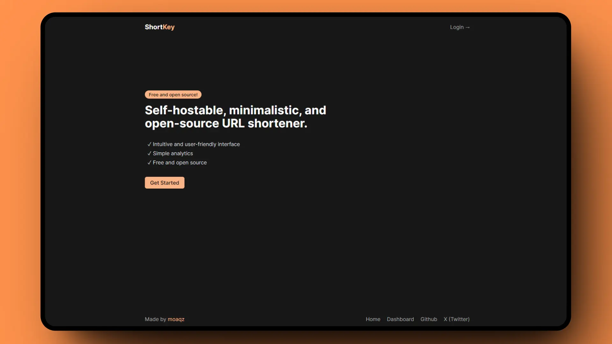

<div align="center">
  <a href="#">
    
  </a>
</div>

## 🚀 Environment Configuration

Create a `.env` file in the root directory of the project. Define the following variables:

```bash
# Google Credentials
NUXT_OAUTH_GOOGLE_CLIENT_ID=
NUXT_OAUTH_GOOGLE_CLIENT_SECRET=
NUXT_OAUTH_GOOGLE_REDIRECT_URI=http://localhost:3000/login/google/callback

# Database
NUXT_DATABASE_URL=
NUXT_DATABASE_TOKEN=

# Optional
NUXT_DATABASE_DEBUG=true 
NUXT_SESSION_SECURE_COOKIE=true
```

Database **(required)**:

- [Create database](https://docs.turso.tech/cli/db/create)
- [Get database token](https://docs.turso.tech/cli/auth/token)

Google Credentials **(required)**:

- [Create a new OAuth 2.0 App from Google API Console](https://developers.google.com/identity/protocols/oauth2?hl=es-419#1.-obtain-oauth-2.0-credentials-from-the-dynamic_data.setvar.console_name-.).

Optional:

- `NUXT_DATABASE_DEBUG`: Set to true to enable database debug mode.
- `NUXT_SESSION_SECURE_COOKIE`: Set to true to enable secure cookies for sessions.

> [!WARNING]
> Ensure all required environment variables are correctly configured before running the application.

## 🐳 Run with Docker in seconds

```bash
docker run -d --name shortkey -p 3000:3000 --env-file .env moaqz/shortkey:0.1.0
```
